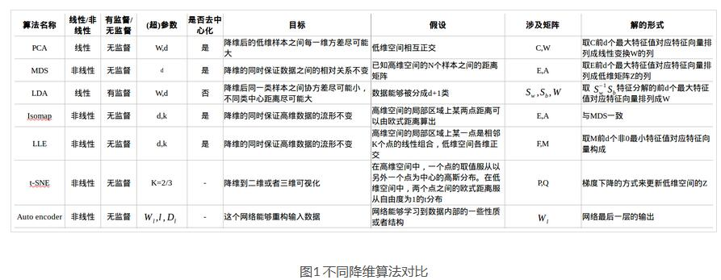
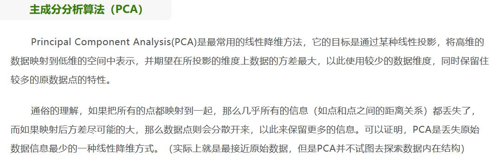
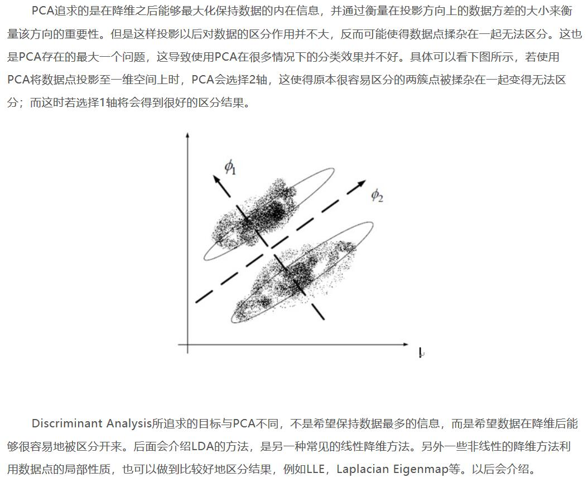
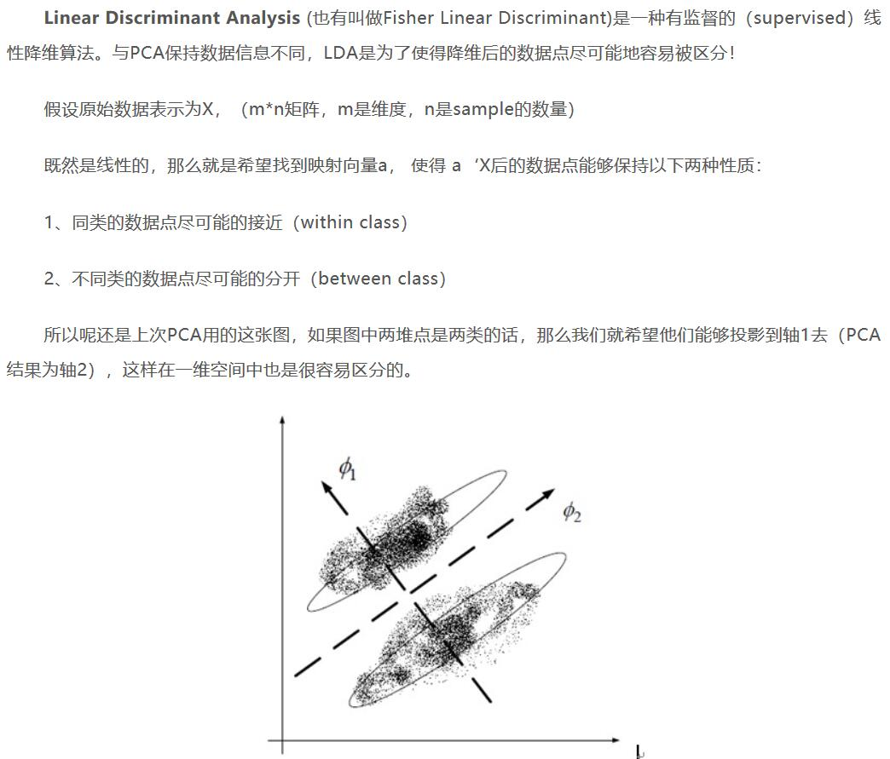
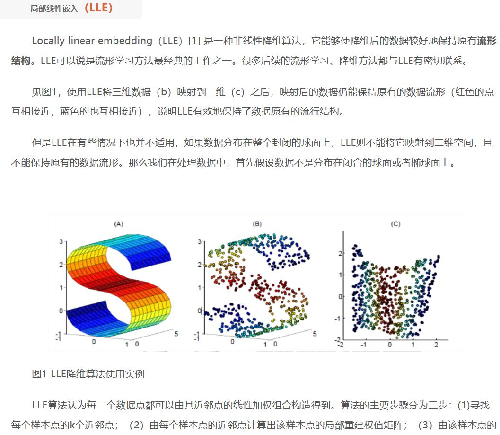

Dimension Reduction

### 0. 综述

在现实生活中很多机器学习问题有上千维，甚至上万维特征，这不仅影响了训练速度，通常还很难找到比较好的解。这样的问题成为维数灾难（curse of dimensionality）。需要注意：降低维度肯定会损失一些信息，这可能会让表现稍微变差。因此应该先在原维度训练一次，如果训练速度太慢再选择降维。虽然有时候降为能去除噪声和一些不必要的细节，但通常不会，主要是能加快训练速度。

现实中有两种主要的降维方法(投影projection and 流形学习Manifold Learning)，并且有三种流行的降维技术：PCA(主要是旗下Kernel PCA)、LDA和LLE。 识记：PCA和LDA都是基于projection的思想，并且都是线性的，只不过PCA是无监督的unsupervised，LDA是有监督的supervised。而LLE是基于Manifold Learning的思想，针对的是非线性的，也是unsupervised。

为什么要引入LLE即Manifold Learning的思想来进行降维，它相较于基于projection的PCA和LDA有何优势？参见文章：机器学习实战(用Scikit-learn和TensorFlow进行机器学习)(九) - CSDN，链接：https://blog.csdn.net/fjl_csdn/article/details/79118212  总之就是projection无法解决swiss roll这类高维空间弯曲的问题。

下面是三者对比：

  

### 1. PCA(principal component analysis, 主成分分析)

BMA-1笔记R语言数据分析之面试专题、机器学习之降维技术都有阐述。 
主要掌握PCA这种基于projection的降维思想方法，确定最接近数据的超平面，然后将数据投射(project)到该超平面上。scikit-learn有专门的pca包干这个事，你把含所有features的X输给它，它就能给你输出一个X_Reduced即降维之后的features list. n_components控制维数。

但有时候数据量很大，内存会不够，这时需要引入IPCA即增量PCA，先将训练样本分为mini-batches，每次给IPCA算法一个mini-batch，这样就能处理大量的数据。scikit-learn有专门的IncrementalPCA。

核PCA(Kernel PCA)：SVM中提到了核技巧，即通过数学方法达到增加特征（将低维projection投射到高维）类似的功能来实现非线性分类（把在低维空间无法线性可分的数据投射到高维空间后使其变得线性可分）。类似的技巧还能用在PCA上，使得可以实现复杂的非线性投影降维，称为kPCA。该算法善于保持聚类后的集群(clusters)后投影，有时展开数据接近于扭曲的流形。scikit-learn有kernelPCA、选择kernel=RBF函数，但此方法要使用大量内存，可能会使内存溢出。可以使用GridSearch来选择合适的kernel func（RBF或者Sigmoid）和参数。

下面阐述PCA的主要思想，以及其与LDA的不同，以及PCA可能面临的问题：

  

  

### 2. Factor Analysis, 因子分析

### 3. LDA(Linear Discriminant Analysis, 线性判别分析法)

  

### 4. LLE, Locally linear embedding, 局部线性嵌入

主要掌握LLE即Manifold Learning这种降维的思想方法，LLE算法认为每一个数据点都可以由其近邻点的线性加权组合构造得到。它的直观思想是希望相互间有关系的点（在多维空间中挨得很近的点）在降维后的空间中尽可能的靠近（这就可以作为一种loss func策略，用它来优化重建矩阵）。

  

算法的主要步骤分为三步：

(1) 寻找每个样本点的k个近邻点-Compute the neighbors of each data point；

(2) 由每个样本点的近邻点计算出该样本点的局部重建权值矩阵-Compute the reconstruction matrix weights that best constructs each data point from its neighbors which also minimizes the cost(loss func, 比如空间中相邻的两个点在降维后依旧挨得很近这种)；

(3) 由该样本点的局部重建权值矩阵和其近邻点计算出该样本点的输出值-Compute the points by their reconstruction matrix weights。

### 5. 其它降维策略包括：t-SNE, Deep Autoencoder Networks, 等度量映射(Isomap)

### 6. 可供参考的一些内容（可参考Python code的写法）：

机器学习之特征工程-降维
https://www.jianshu.com/p/6a9db201cb13

四大机器学习降维算法：PCA、LDA、LLE、Laplacian Eigenmaps 
http://dataunion.org/13451.html

【机器学习算法系列之三】简述多种降维算法
https://chenrudan.github.io/blog/2016/04/01/dimensionalityreduction.html

Scikit-Learn与TensorFlow机器学习实用指南 中文精要 八、降维
https://juejin.im/entry/5ac4e2d551882548515358cf

### 7. 怎么甄别该选哪种降维技术？

没有找到相关资料。