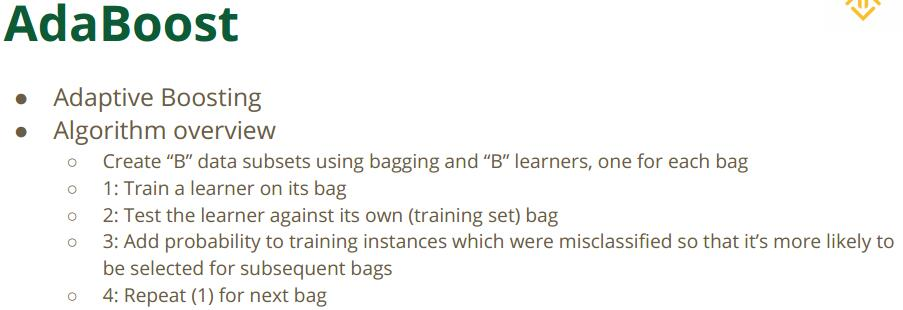

Ensemble Learning

### 总体分类

a. bagging 
	a1. Random Forest
b. boosting 
	b1. Adaboost-Adaptive Boost 
	b2. Gradient Boost 
		b21. XGBoost 
		b22. GBDT 

### bagging的理论依据

central limit theorem，中心极限定理，这是random forest这种bagging strategy依托的理论依据，就是你有放回采样repeated sampling的分布符合normal distribution。正是有了这个理论依据，我们才敢用bagging策略。 
常见的bagging策略比如Random Forest，它randomly split data，randomly choose features（一般取sqrt(n)个features），也就是说构建好几个bag，然后用这些bag各自train multiply classifiers and let them vote.

### boosting

boosting是对bagging的进一步改进，它create several learners，each learner focuses on the errors observations the previous learners made. 也就是它learn from the mistakes.

### Adaboost

 

### 参见示例.ipynb，以及scikit-learn中相关的classifier名称

DecisionTreeClassifier(sklearn.tree) 
RandomForestClassifier(sklearn.ensemble) 
AdaBoostClassifier(sklearn.ensemble) 