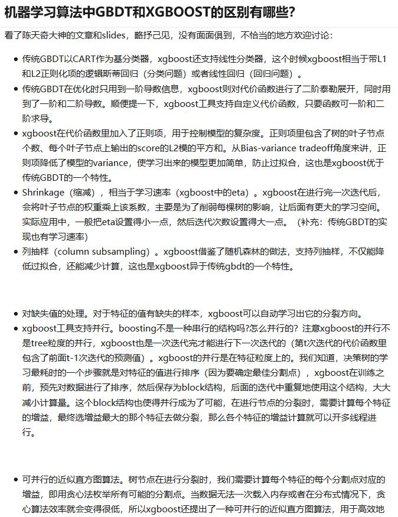

Ensemble Learning

### 总体分类

a. bagging 
	a1. Random Forest
b. boosting 
	b1. AdaBoost-Adaptive Boost 
	b2. Gradient Boost 
		b21. XGBoost 
		b22. GBDT-Gradient Boost Decision Tree 
 
## AdaBoost和Gradient Boost有啥区别，AdaBoost就是每次把前一个classifier分错的数据、加上更高的weights、这样后续的classifier在选training数据时、会更容易抽到这些被之前的classifier分错的数据、于是会更多地关注到这些容易分错的数据。 
## 而Gradient Boost是说，它每次构建新的classifier的时候、学习的是之前classifier的residual（即残差），这才是其Gradient的意义所在。否则Gradient难道是每棵树独立训练一遍，比如A这个人，第一棵树认为是10岁，第二棵树认为是0岁，第三棵树认为是20岁，我们就取平均值10岁做最终结论？--当然不是！且不说这是投票方法并不是GBDT，只要训练集不变，独立训练三次的三棵树必定完全相同，这样做完全没有意义。之前说过，GBDT是把所有树的结论累加起来做最终结论的，所以可以想到每棵树的结论并不是年龄本身，而是年龄的一个累加量。GBDT的核心就在于，每一棵树学的是之前所有树结论和的残差，这个残差就是一个加预测值后能得真实值的累加量。比如A的真实年龄是18岁，但第一棵树的预测年龄是12岁，差了6岁，即残差为6岁。那么在第二棵树里我们把A的年龄设为6岁去学习，如果第二棵树真的能把A分到6岁的叶子节点，那累加两棵树的结论就是A的真实年龄；如果第二棵树的结论是5岁，则A仍然存在1岁的残差，第三棵树里A的年龄就变成1岁，继续学。这就是Gradient Boosting在GBDT中的意义。 
## AdaBoost,重复选择一个表现一般的模型并且每次基于先前模型的表现进行调整.不同的是,AdaBoost是通过提升数据点的权重来定位模型的不足而Gradient Boost是通过算梯度来定位模型的不足.因此,相比于AdaBoost,gradient boosting可使用更多种类的目标函数.二者最主要的区别在于两者如何识别模型的问题.AdaBoost用错分数据点来识别问题,通过调整错分数据点的权重类改进模型.Gradient boosting通过梯度来识别问题,通过计算梯度来改进模型。如果希望看详细可参看链接：https://blog.csdn.net/liyuan123zhouhui/article/details/66968406 
 
GBDT的基学习器是分类回归树CART，XGBoost除了支持用CART作基分类器还支持用Logistic作基分类器。另外XGBoost在构建分类器的时候加入了L1或L2 norm、于是可以防止模型过于复杂overfit、同时加快了训练速度，另外XGBoost还支持sampling on columns也就是列抽样、这就像借用了Random Forest的做法、进一步降低了过拟合，可以说XGBoost是对GBDT的又一项改进。XGBoost快，非常快，最新版本支持spark，4000多万样本，70个dimension，200棵树的训练也就1小时不到。更具体的上知乎去看吧。 
 

### bagging的理论依据

central limit theorem，中心极限定理，这是random forest这种bagging strategy依托的理论依据，就是你有放回采样repeated sampling的分布符合normal distribution。正是有了这个理论依据，我们才敢用bagging策略。 
常见的bagging策略比如Random Forest，它randomly split data，randomly choose features（一般取sqrt(n)个features），也就是说构建好几个bag，然后用这些bag各自train multiply classifiers and let them vote.

### boosting

boosting是对bagging的进一步改进，它create several learners，each learner focuses on the errors observations the previous learners made. 也就是它learn from the mistakes.

### AdaBoost

 

### 参见示例.ipynb，以及scikit-learn中相关的classifier名称

DecisionTreeClassifier(sklearn.tree) 
RandomForestClassifier(sklearn.ensemble) 
AdaBoostClassifier(sklearn.ensemble) 