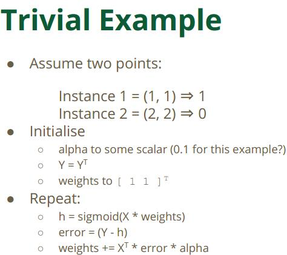

Logistic Regression

### 基础知识

参见USFCA的ML课的ppt，是Classification的第01.pdf  这里摘关键的。 上机例子有TweetsIsPoliticalOrNot不过这个例子confusion matrix看起来挺烂的。

主要就是会用到matrices的transpose和multiply这些，还有step functions（sigmoid）、gradients、Learning rate（alpha）和initial value。自己ML课.note笔记里有手工算Gradient的过程。

fit算出来的weights的matrixweights[0]、weights[1]和weights[2]是啥？比如有X0, X1 -> Y，那么weights matrix就相当于linear regression算出来的coefficients，weights[0]相当于intercept，weights[1]是X0的coefficient，weights[2]是X1的coefficient。你有新sample data X0, X1来了以后，predict代入weights matrix就能算出来一个结果、再用sigmoid函数判断下hypothesis是>0.5还是<0.5就能得到prediction的分类(0还是1)。

alpha是step size即步长、也叫Learning rate，如果设地很大、算法可以很快convergence、但是可以看出此时weights一直在震荡因为找不到极小值，因为alpha is too big。

【怎么解释呢】当alpha很大时，在曲线图上，你的global minimum全局最小值的寻找过程（倒抛物线），很容易从左面跳到右面，也就是忽略过真正的全局最小值，所以你算法收敛很慢，即一直在震荡
当alpha较小时，可以比较快地找到全局最小值，但带来的risk是很容易陷入local minimum即局部极小值。

比如我们有(X1, X2) -> Y的一系列样本，那么我们的weights matirx会是下面这个样子： 
  [weights[0]的值，初始always是1] 
  [weights[1]的值] 
  [weights[2]的值] 
  也就是说，如果你有两个变量X1 X2去预测classifier Y，那么weights matrix会是三行一列的，第一行就是1，第二三行分别是对应X1的系数和X2的系数。 
  然后，改变initial weights的后果。可以这么想，最终你一定会得到适合的weights，但如果你的initial weights设地就跟最终求得weights比较接近、那么就可以比较快地算法收敛、找到最终的weights（试想weights就是带斜率的斜线 
  但如果你的initial weights设地不好，那么你可能很长时间才能找到最终的weights 
  你不需要一开始guess你的weights，但一个好的initial weights可以缩短你算法收敛的时间 

 
 
 
 
 
 

### Logistic Regression、LASSO Regression(L1 norm)和Ridge Regression(L2 norm)三种回归的探讨

L1常用于特征选择feature selection，当样本集含有大量变量（也即特征值、维度），甚至变量数比样本数还要多的时候，比如1000个变量时，我们如何能从中判定出对我们有用的变量

L2常用于消除过拟合overfitting

L1正则化是指权值向量w中各个元素的绝对值之和，通常表示为||w|| 1   

L2正则化是指权值向量w中各个元素的平方和然后再求平方根（可以看到Ridge回归的L2正则化项有平方符号），通常表示为||w|| 2

L1正则化和L2正则化可以看做是损失函数的惩罚项。所谓『惩罚』是指对损失函数中的某些参数做一些限制。

l1正则化，它对于最后的特征权重的影响是，让特征获得的权重稀疏化，也就是对结果影响不那么大的特征，干脆就拿不着权重。

l2正则化，它对于最后的特征权重的影响是，尽量打散权重到每个特征维度上，不让权重集中在某些维度上，出现权重特别高的特征。

scikit-learn中使用的方法就是在logisticRegression函数里加一个penalty惩罚项，指定是l1或者l2。加上以后logistic regression就有了这个功能：

from sklearn import linear_model

clf = linear_model.LogisticRegression(C=1.0, penalty='l1', tol=1e-6)

clf.fit(X, y)

反正就是避免model过于复杂，要么就是引入了太多没必要的变量，要么就是对已有的变量引入了太多太复杂的高阶项（其实都可以删掉）。加上penalty之后，在模型想要引入更多变量或更复杂的高阶项时、也会有一定的惩罚，从而实现“中和”。

我们知道，L1和L2都是规则化的方式，我们将权值参数以L1或者L2的方式放到代价函数里面去。然后模型就会尝试去最小化这些权值参数。而这个最小化就像一个下坡的过程，L1和L2的差别就在于这个“坡”不同，如下图：L1就是按绝对值函数的“坡”下降的，而L2是按二次函数的“坡”下降。所以实际上在0附近，L1的下降速度比L2的下降速度要快。所以会非常快得降到0。所以L1构建模型会更快效率更高，L2则能消除过拟合：

  

什么叫过拟合？按照Andrew Ng的讲述，过拟合就是模型引入了太多不必要的四次方、五次方、六次方等特征项，如下：
 
如何防止过拟合？就是在定义loss损失函数（误差）的时候，给四次方、五次方、六次方这些项加上一个惩罚函数（penalty func），使得它们的参数尽可能趋向于0，消减它们对模型的影响，同时也使得我们的模型更加简单直观（没有了什么复杂的四次方、五次方、六次方）

  