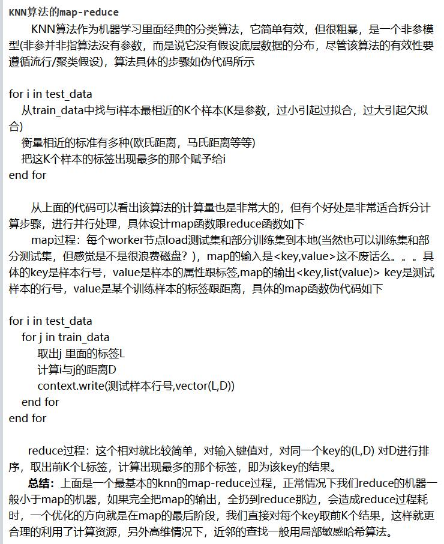
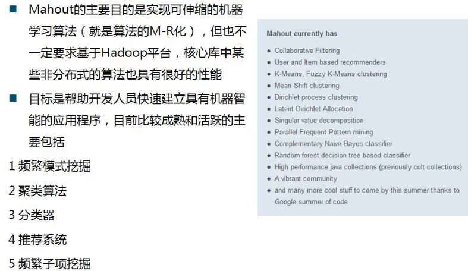

Machine Learning Parallel Strategy in Map Reduce

### 0. 哪些ML算法适合被MR化，哪些不适合？ML算法到底是用Hadoop的Map Reduce实现并行化（比如Mahout）好还是用Spark的MLlib实现并行化好？

首先，Map Reduce其实不适合做机器学习，更适合大规模的简单化的数据处理。因为你想啊Map Reduce中间结果都放磁盘，这中间I/O成本很高（这也是为什么Spark全内存计算会快的原因）。如果你只做简单的count、sum这类统计操作，那I/O不太多，Map Reduce还ok，但如果进行机器学习，涉及到反复的自我迭代iteration（迭代就是重复反馈过程的活动，其目的通常是为了逼近所需目标或结果。每一次对过程的重复称为一次“迭代”，而每一次迭代得到的结果会作为下一次迭代的初始值），那这中间I/O活动海了去了，这时Map Reduce的磁盘I/O瓶颈会暴露无遗。没听说用Map Reduce跑什么深度学习算法和back propogation的。

所以说，需要反复自身迭代计算大量中间值和参数的ML算法都不适合Map Reduce化。不是说不行，只是效果并不好。不过毕竟对一些算法比如kNN进行Map Reduce后还是可以提升些效率试试的。

### 1. ML算法基于Hadoop的Map Reduce化（以kNN为例，其它不做过多研究）

***要想想案例怎么说，数据量多大，效果如何之类***

具体参考这篇文章，https://www.cnblogs.com/kobedeshow/p/3600328.html 标题“常见数据挖掘算法的Map-Reduce策略(1)”来自YYGamer->QQSearcher。 总结了kNN、k-means、Decision tree和Bayes的Map Reduce策略，已收录进github的word。

  

每个计算节点load测试集和一部分训练集，map的input是测试集行号（就是每个测试记录的id）、value是测试集的属性。map的output是key, list<value>，其中key依旧是测试集行号，value变成训练集的<L:D>对儿，L是训练集的label，D是该训练集跟该测试集的distance。这时可以filter一下只取list的前k条。

然后map的output传给reducer的input，在reduce里对每个key（每个测试集编号）的value对儿的D排序、取前k个、然后统计出现次数最多的L作为该测试集的最终L。

具体代码可参考：https://blog.csdn.net/q383700092/article/details/51780865 k近邻KNN之MapReduce实现 - CSDN“余音丶未散的博客”

Google的Planet系统paper专门实现Map Reduce化的Random Forest，还有Yahoo研究院也有paper。

### 2. ML算法的Mahout

Mahout是一个函数库，它把日常常用的机器学习算法都封装成了函数，并且将这些算法的实现都MapReduce化了。你直接调用这些函数，就可以运用到这些MapReduce化的机器学习算法。访问mahout.apache.org就能看到所有Mahout里已经包含的MapReduce化的机器学习算法，当然有些算法是无法MapReduce化的，这类算法就不在Mahout里。

  

### 3. ML算法的Spark MLlib