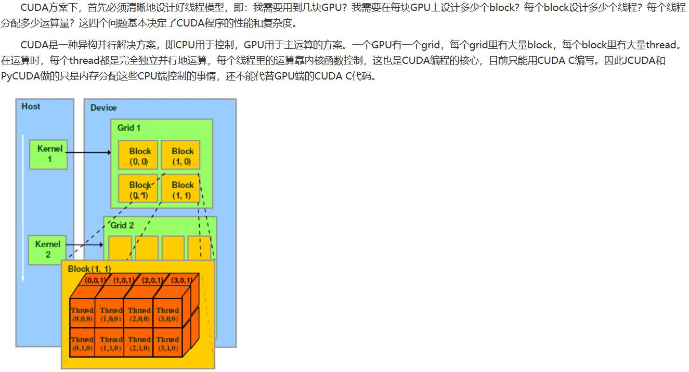

# 未来一些研究方向

## 使用C/C++实现ML
That's why scikit-learn is pretty faster than our models implemented in Python. 毕竟Python是Interpreted Language解释型语言，运行时需要二次翻译，跟Java一样，而C/C++是Compiled Language，运行时几乎可以直接跑。但是Python上面的库和包比较多，所以一般公司都是用Python作整体框架和PoC，等model顺利通过验证后用C/C++实现，并用Python来调接口。

## CUDA
在TensorFlow里做一下配置，让其可以运行在GPU上使用到GPU的资源。因为GPU不需要像CPU那样有很多控制单元ALU所以可以一心一意被设计来完成并行计算。同时开几千个thread来跑。 
GPU特别擅长于做向量vector运算和浮点运算, 因此近几年在机器学习比如神经网络和线性回归方面特别有优势。 
CUDA软件 – 相当于NVIDIA GPU的C语言interface, 可供开发者调用, 进一步发挥GPU的高性能NVIDIA的GPU分为三个系列，面向大众的 Geforce系列，面向工业图形设计的Quadro系列，面向科学计算的Tesla系列。 
Geforce系列由于面向大众，要和AMD的显卡竞争，所以性价比最高，单从性能上看甚至不输Tesla系列，但可能耐久性等其他方面不及Tesla。 
英伟达的 Tesla GPU 性能有多强劲，跟普通 GPU 的主要区别是什么：除Tesla M40外，NVIDIA Tesla GPU拥有非常多的FP64 CUDA Core，双精度计算能力非常优秀，还有针对半精度的FP16 CUDA Core，单精度的FP32 CUDA Core，这类GPU被称为计算卡，用于深度学习，超级计算机，但是不能用来玩游戏，因为FP64是对游戏一点用也没用的。而到最新的Pascal架构的Tesla P100，NVIDIA已经对市场非常有针对性了，Tesla P100取消了游戏卡的Rops单元，全面腾出空间给计算。 
主要就是安装CUDA 7.0之后，使用Visual Studio 2013开发，然后使用C语言调API。CUDA架构是有Host和Kernel之分，Host是处在CPU这一端，做一些准备数据和显示最终结果的接口工作，为GPU的显存提供数据，然后GPU端叫kernel负责具体并行计算。kernel这部分分Grid，每个Grid分多个block，每个block里可以有多个thread，各个thread可以share一个block的内存。这样就能实现大规模并行，把CPU和GPU的性能都发挥地淋漓尽致。 
具体可以看书《深入浅出谈CUDA》。 
这篇博客介绍CUDA一些架构的知识：CSDN - CUDA编程（一）第一个CUDA程序: https://blog.csdn.net/sunmc1204953974/article/details/51000970 
这篇博客实例介绍一个CUDA小案例：博客园 - 记一次CUDA编程任务 - 蓝鲸王子: https://www.cnblogs.com/shixiangwan/p/6403705.html 
  