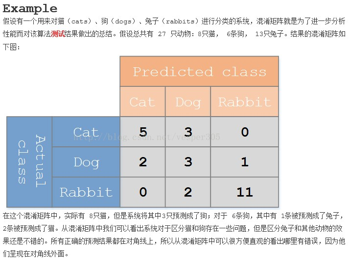
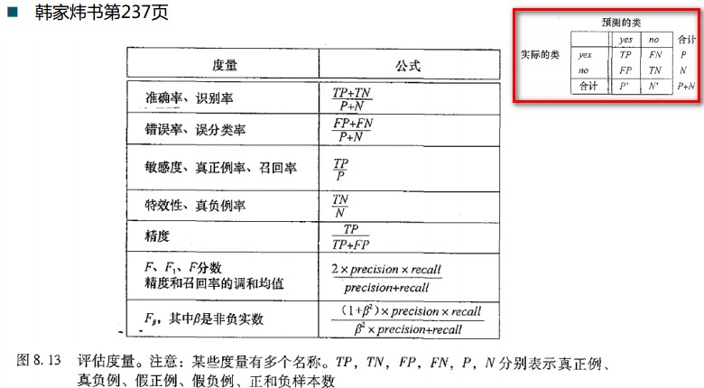

Statistics basic

 ### (1) Hypothesis test, always used to evaluate the coefficients and their p-values, significance test, the relation of X with Y is statistically significant or not

     to evaluate if beta_1 is statistically significantly different from zero,

     H_0: beta_1 == 0

     H_1: beta_1 != 0

     t-test, student test, t distribution

     p-value < 0.05 (significance statistically), reject H_0 accept H_1, or else ...

     计算实例可参考ML courseNotes.pdf P168+169+171+172

     计算实例也可参考ML homework_02.ipynb Question 4 计算t star, t critical，如果t star > t crit那么reject H_0

     公式记忆t star = b1 / s{b1}, t cric = t_distribution(0.025, n-2) n是training data count

     公式记忆b1是model.summary()出来的coefficient，s{b1}是coefficient跟前的std error

     公式记忆也有一种算法是b1是sample mean，s{b1}是std(sample) / sqrt(n) n是training data count

 ### (2) Confidence Interval (CI) Estimation

     针对mean Y，在给定X下，有百分之多少的confidence知道mean Y的范围

     计算实例可参考ML courseNotes.pdf P168+169+171+172, 188

     计算实例也可参考ML homework_02.ipynb Question 4 计算t star, t critical，如果t star > t crit那么reject H_0

 ### (3) Prediction Interval (PI) Estimation

     针对observation Y（即真实的Y value)，在给定X下，有百分之多少的confidence知道actual Y的范围

     计算实例可参考ML courseNotes.pdf P200

 ### (4) Analysis of Variance approach, ANOVA table

     SLR ANOVA table, 1 predictor, P228, remember: for df, SSR = 1, SSE = n-2, SSTO = n-1

     MLR ANOVA table, p-1 predictors, P306, remember: p is count of predictors, for df, SSR = p-1, SSE = n-p, SSTO = n-1

     MLR Type I ANOVA table, P332

     MLR Type II ANOVA table, P334, 两者区别对比看下图一看便知, 两张图在Python里如何生成P335+336

 ### (5) R-squared = SSR/SSTO = 1 - SSE/SSTO, 0到1之间，越接近1越好, P218, P219

     Higher R-squared does not imply that the estimated regression line is a good fit.
     Higher R-squared does not imply that X and Y are not related.

     WHY involves Adjusted R-squared? P309-313, 1-SSE/SSTO变成SSE除以自己的df n-p和SSTO除以自己的df n-1

 ### (6) SSTO, SSR, SSE, MSR, MSE, related with Confidence Bands P204

     Total Sum of Squares, SSTO, Yi - mean Y, dof n-1, ML courseNotes.pdf P207

     Error/Residual Sum of Squares, SSE, Yi - estimated Y, dof n-2, ML courseNotes.pdf P208

     Regression Sum of Squares, SSR, estimated Y - mean Y, dof 1, ML courseNotes.pdf P209

     三者关系P212, Total Deviation = Deviation of fitted regression value around mean + Deviation of unfitted regression value around mean

     For SLR: MSR = SSR / 1, MSE = SSE / (n-2); for MLR: MSR = SSR / (p-1), MSE = SSE / (n-p), p is count of predictors.

     P330: in MLR, SSR(X1, X2, ..., Xp-1) != SSR(X1) + SSR(X2) + ... + SSR(Xp-1), it is...

 ### (7) Diagnostics for Residuals, an evaluation of residuals

     Heteroskedasticity，异方差性，给定解释变量，误差项的方差不为常数。与我们做OLS时的基本假设相悖。
     Homoskedasticity，  同方差性，回归模型中的误差在解释变量条件下具有不变的方差。 

     Residual Plot, plot the residuals against the predictor variable X, hope to see a random distribution rather than following any pattern of residuals for all values of X, P239. If we see constant error variance from Residual Plot then we establish Homoskedasticity.

     What is the principle of BF-test for checking Homoskedasticity? P243

     What is the hypothesis test of BF-test for checking Homoskedasticity? P245

     median or mean? P246, 选择比较两组的median group residual or mean group residual，然后get conclusion

     What is the hypothesis test of Shapiro-Wilk Test for checking Normal Distribution of Residuals? P260 符合的话说明好。

     What is QQ Plots for checking Normal Distribution of Residuals? P261+262 点尽可能全部落在线上说明好。

 ### (8) Remedial measures, 当我们发现线性没法fit的时候，尝试做transformation of X或Y

     P267+270, 如果plot发现X和Y不是linear关系，一般先尝试transform X，取log_10(X), X^2, 1/X, sqrt(X), 或者对Y作类似的尝试然后比效果

     P271, 如果plot发现X和Y的确是linear关系而residual却是Heteroskedasticity的，那么说明X和Y需要同时transform

     Box-Cox Transformation，不断算SSE然后比出来一个most optimized pow for Y, then we use that for Y's pow transformation

 ### (9) Coefficient of Partial Determination, P345, R^2Y1|2 = (SSE(X2) - SSE(X1|X2)) / SSE(X2)

 ### (10) Multicollinearity, say one predictor is correlated with another

     坏处：会potentially causing many of the estimated regression coefficients not to be statistically significant. P358, 此时addiing new predictors into model对SSE的decrease effect会不significant

     用专业点的话说，P363, When adding one explanatory variable that is highly correlated with an explanatory variable already in the model, the marginal contribution of the additional variable in reducing SSE is often comparatively small. 

 ### (11) AIC BIC SBC：

 赤池信息准则AIC

 贝叶斯信息指数BIC

 Link： http://sofasofa.io/forum_main_post.php?postid=1000201, smaller is better

 ### (12) Confusion matrix, Precision/Recall, ROC/AUC

参考链接：http://blog.csdn.net/lichao_ustc/article/details/52702964

应用实例参见kNN下KNN_on_Class_Apr102018.ipynb

  
  

precision = tp / (tp + fp)

recall = tp / (tp + fn)

Wikipedia有关recall和precision的解释：https://en.wikipedia.org/wiki/Precision_and_recall

F1 score, how well do I specifically perform on only malignant cancer prediction? 就是我只关注我在恶性肿瘤上的预测准确率有多高，而不是关注我在所有肿瘤类型恶性+良性一共的准确率有多高（因为你想啊，如果本身有90%的患者都是良性肿瘤，只有10%的患者是恶性肿瘤，那就算我的model再傻逼，我预测全部患者都是良性肿瘤，那我的准确率还有90%呢，但其实这没任何意义）

F1 score = (2*precision*recall) / (precision + recall)

参见百度百科对ROC和AUC的解释：https://baike.baidu.com/item/ROC%E6%9B%B2%E7%BA%BF/775606?fr=aladdin

选择最佳的诊断界限值。ROC曲线越靠近左上角,试验的准确性就越高。最靠近左上角的ROC曲线的点是错误最少的最好阈值，其假阳性和假阴性的总数最少。

最靠近左上角的ROC曲线所代表的受试者工作最准确。哪一种试验的 AUC最大，则哪一种试验的诊断价值最佳。