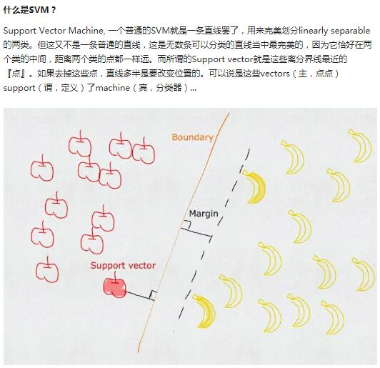

SVM

### 主题思想，什么是Support Vectors？
就是投影projection到更高维空间，attempt to find out a hyperplane来classify数据，宗旨是该hyperplane具备the largest width。也就是说要maximize the margins：也就是gap between hyperplane and the nearest observations (即support vectors)。
 
 

### 什么叫Slack Variables（松弛变量），对应的惩罚因子penalty C是什么？为什么要引入它、有啥用？
引入松弛变量的动机是原来的线性限制条件在面对非线性可分数据时需要松弛，这样才能保证算法收敛。使用变量C，我们可以控制错分类的惩罚量。和Logistic回归不同，这里C越大，对于错分类的惩罚越大。可以通过C控制间隔的宽度。 
这样来说吧，如果你的数据是严格linear separable的，那简单，你的margin可以很轻松自如地被找到，然后margin还很宽。但如果你的数据是nonlinear separable的，那此时SVM找起来就费了劲了，半天找不到这样一个margin，找到还可以其实很窄很窄，表现就是长时间算法不能convergence。此时你可以加一个C、让它“宽松”一些、允许有一些分错的observations（而且这些observations很可能就是outliers、噪声而已）、这样就能兼顾到效率了。 
从scikit-learn.svm中导入SVC、有一个参数C=1.0这种就是干这个的。如果你的问题线性可分，你就可以设kernel='linear'，否则你就设kernel='RBF'或者'polynomial'。 
惩罚因子C增大时，错分样本减少，分类间隔当然减小了,此时因为这个margin很小、所以SVM会需要较长时间才能convergence、才能找到这个margin。 
 
具体可以参见链接：https://blog.csdn.net/qll125596718/article/details/6910921  内包含SVM面对inbalance data的解决。 

### 什么时候引入kernel function（核函数）？
SVM针对的observations有两类，一类是linear separable，这时你直接用SVM即可。还有一类是nonlinear separable，这时你可以考虑引入Slack Variable，也可以考虑加kernel function投射到高维空间（如果使用了slack variable及其惩罚因子C都无济于事的情况下）、使nonlinear separable的问题在高维空间上变得linear separable。
 

### kernel function有哪些，有啥区别？
kernel functon = Polynomial or RBF-Radial Basis Function-径向基函数 or linear（仅适用于线性可分的情形） or Sigmoid。 
一般线性不可分的情形我们也就用用RBF，Polynomial和Sigmoid一般都不用。使用Sigmoid作为核函数时，SVM其实演变成了一种Multiple layer Perceptron。 
 
RBF核SVM的时候最重要的就是cost和gamma参数的设置，它们对结果有较大影响。Cost就是惩罚因子Penalty（也就是你对误差的宽容度，这个值越高，说明你越不能容忍出现误差，当然convergence会比较慢，找出来的margin也会更窄, C越小，容易欠拟合。C过大或过小，泛化能力变差）； 
gamma是选择RBF函数作为kernel后，该函数自带的一个参数。隐含地决定了数据映射到新的特征空间后的分布，gamma越大，支持向量越少，gamma值越小，支持向量越多。支持向量的个数影响训练与预测的速度。一般在实际的libsvm或者scikit-learn中我们用GridSearchCV来寻找更合适的C和gamma参数。 
Polynomial：n次多项式核函数，适用于图像处理问题。选择n的好方法是从1(一个线性模型)开始，然后递增至估计误差不再改进为止。通常，相当小的数目就足够了。 
linear核，更快，但只适用于线性，尤其对大批量数据来说更好；RBF核，慢，当然也能拟合线性，此时和linear核效果一样，但对大批量数据就太慢了。

### 应用libsvm or scikit-learn里的SVM时怎样能得到比较好的效果？
因为是处理连续值、所以调用scikit-learn的SVR（SVM模型的Regressor版，当然如果是处理分类问题、则须调用scikit-learn的SVC即SVM模型的Classifier版）
 
libsvm经过optimization效率很高。libsvm里选kernel的时候不像scikit-learn，libsvm里是用0-线性、1-多项式、2-RBF、3-Sigmoid来代表四种核。 
1. 对数据做归一化（simple scaling） 
2. 应用RBF kernel  
3. 用cross-validation和grid-search 得到最优的C-惩罚因子（C一般可以选择为：10^t , t=- 4..4就是0.0001到10000）penalty和gamma（default 1/num_features，一般选择从[2^(-8),2^8]寻找） 
4. 用得到的最优C和gamma训练训练数据 
5. 测试 
应用libsvm需要将原数据用formatdatalibsvm转换为2 1:7 2:5这种格式。有关libsvm的使用参见链接：http://blog.sina.com.cn/s/blog_6a41348f0101ep7w.html CSDN博客-我相信的博客 LIBSVM使用方法及参数设置。 
label index1:value1 index2:value2..... 
Label在文件中表示该行样本数据的类别标识（比如第3类、第2类），index表示该行样本数据的某个特征的序号，一般从1开始，依次增大，而Value表示对应该特征的值。 
例如： 
3 1:0.122000 2:0.792000 3 1:0.144000 2:0.750000 3 1:0.194000 2:0.658000 
3 1:0.244000 2:0.540000 3 1:0.328000 2:0.404000 3 1:0.402000 2:0.356000 
3 1:0.490000 2:0.384000 3 1:0.548000 2:0.436000  
即有一行样本，其分类标识Y为3，第1个维度X1的值为0.122，第2个维度X2的值为0.792，等等。 
libsvm中提供了数据归一化工具，就是svm-scale这个工具。如果你的数据文件已经满足了svm的格式要求，即label1:value12:value2.... 这种格式，那么在window平台下，你可以直接调用libsvm\windows\svm-scale.exe文件来进行归一化操作。参见：https://blog.csdn.net/jeryjeryjery/article/details/72649320 
扫描数据. 因为原始数据可能范围过大或过小, svmscale可以先将数据重新scale (縮放) 到适当范围使训练与预测速度更快。 
svmscale.exe的用法：svmscale.exe feature.txt feature.scaled 默认的归一化范围是[-1,1]，可以用参数-l和-u分别调整上界和下届,feature.txt是原始训练集文件名，输出的归一化训练集数据为feature.scaled。一般归一化之后准确率svm-predict accuracy可以从66%提升到96%。 

### SVM的Pros and Cons
SVM一般在linear separable的问题上表现比Logistic Regression更好，在Nonlinear separable的问题上两者performance差不多。