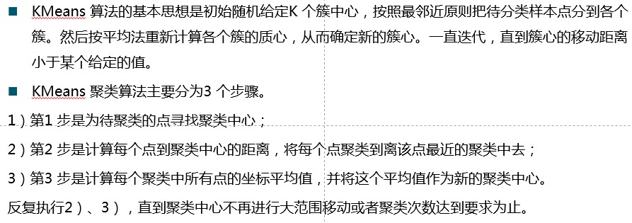
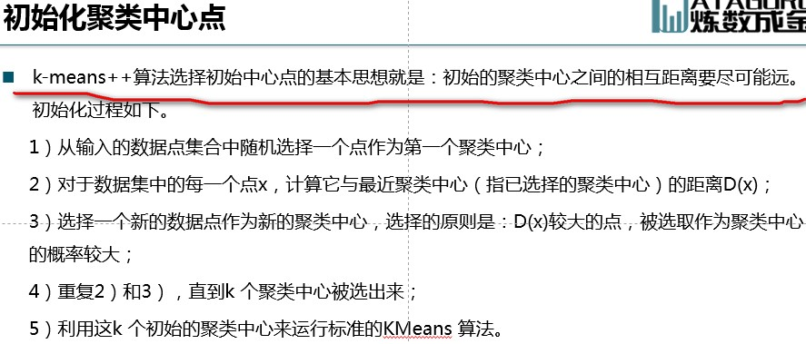
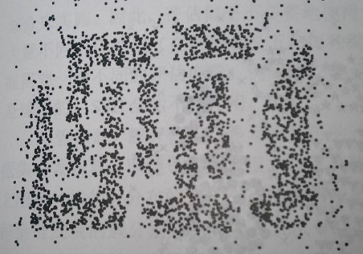

k-Means

### 详细内容参见kmeans-updated路径下.ipynb

### 一种聚类Clustering算法，Unsupervised无监督的（不像kNN那样需要用到训练数据的label）。We are trying to minimize the sum of distances from each observation point to its cluster's centroid so that every cluster will be highest closely tighted.

### 一些关键词，centroids, observations, minimize SSE Sum of Squares, WSS Within-Cluster Sum of Squares, 要使用k-means续符合两个prerequisites, within-cluster variation is minimized

### Algorithm: choose randomly on k centroids(其实也不是完全的随机，可遵守kmeans++算法来寻找), k clusters, assign every observation to its centroid/cluster, 每次把一个新的observation points点加入到某个cluster之后，那个cluster的centroid就会改变从而需要重新计算，until convergence which means no more observations switch over between clusters. 初始centroid的coordinates值往往可以取某个cluster里所有observation points的X,Y坐标的各自均值。所以第一步，KMeans聚类算法要做的，就是选择初始中心点。选择初始中心点有一种算法，叫作k-means++，它是：
  
  
 还有一种算法叫k-means||，它相较于k-means++的优势在于（解决了k-means++的问题），参见最底部探讨。

### Sikit-learn: KMeans(n_clusters=4), .fit(), .predict(), 使用kmeans.inertia_可以看到这种情况下的最终收敛的Within-Cluster Sum of Squares (WSS).

### Problem: k-means有个趋势，k越大（越接近于observations数），WSS越小（因为此时没有observations都会是自己的centroids，但这明显是不合理的），如何避免？使用Elbow method（肘部法则），让k用GridSearchCV逐步增大、然后画出每个k对应的Within-Cluster Sum of Squares、看k是多少的时候、WSS的减少率开始变小、即再增大k、对WSS减小的贡献已经很少了、就选哪个k最合理。

### 使用k-means的potential issues:
1. 受初始化时选取的centroids的影响很重，所以才需要引入kmeans++和kmeans||两种算法：

 参见.ipynb最下面的图

2. 对样本点分布不是球形（选取centroids就有问题了）或是分布很不均匀（密度有影响）的情况会很糟糕，这时建议用DBSCAN：

  

### k-means++和k-means||：
下面内容摘录自BMA笔记有关Spark MLlib的章节。 
一、k-means算法缺点: 
1、需要提前指定k 
2、k-means算法对初始化非常敏感 
k-means++主要用来解决第二个缺点 
 
二、k-means++算法原理分析 
k-means++算法选择初始聚类中心的基本原则是：初始的聚类中心之间的相互距离要尽可能的远。它选择初始聚类中心的步骤是： 
 （1）从输入的数据点集合中随机选择一个点作为第一个聚类中心； 
 （2）对于数据集中的每一个点x，计算它与最近聚类中心(指已选择的聚类中心)的距离D(x)，并根据以下概率选择新的聚类中心。 
 （3）重复过程（2）直到找到k个聚类中心。 
 第(2)步中，依次计算每个数据点与最近的种子点（聚类中心）的距离，依次得到D(1)、D(2)、...、D(n)构成的集合D，其中n表示数据集的大小。在D中，为了避免噪声，不能直接选取值最大的元素，应该选择值较大的元素，然后将其对应的数据点作为种子点。  如何选择值较大的元素呢，下面是spark中实现的思路。 
  求所有的距离和Sum(D(x)) 
  取一个随机值，用权重的方式来取计算下一个“种子点”。这个算法的实现是，先用Sum(D(x))乘以随机值Random得到值r，然后用currSum += D(x)，直到其currSum>r，此时的点就是下一个“种子点”。 
 为什么用这样的方式呢？我们换一种比较好理解的方式来说明。把集合D中的每个元素D(x)想象为一根线L(x)，线的长度就是元素的值。将这些线依次按照L(1)、L(2)、...、L(n)的顺序连接起来，组成长线L。L(1)、L(2)、…、L(n)称为L的子线。根据概率的相关知识，如果我们在L上随机选择一个点，那么这个点所在的子线很有可能是比较长的子线，而这个子线对应的数据点就可以作为种子点。 
 
三、k-means++算法的缺点 
   虽然k-means++算法可以确定地初始化聚类中心，但是从可扩展性来看，它存在一个缺点，那就是它内在的有序性特性：下一个中心点的选择依赖于已经选择的中心点。针对这种缺陷，k-means||算法提供了解决方法。 
 
四、k-means||算法原理分析 
    k-means++ 最主要的缺点在于其内在的顺序执行特性，得到 k 个聚类中心必须遍历数据集 k 次，并且当前聚类中心的计算依赖于前面得到的所有聚类中心，这使得算法无法并行扩展，极大地限制了算法在大规模数据集上的应用。 
k-means||   主要思路在于改变每次遍历时的取样策略，并非按照 k-means++ 那样每次遍历只取样一个样本，而是每次遍历取样 O(k) 个样本，重复该取样过程大约 O(logn) 次，重复取样过后共得到 O(klogn) 个样本点组成的集合，该集合以常数因子近似于最优解，然后再聚类这 O(klogn) 个点成 k 个点，最后将这 k 个点作为初始聚类中心送入Lloyd迭代中，实际实验证明 O(logn) 次重复取样是不需要的，一般5次重复取样就可以得到一个较好的聚类初始中心。